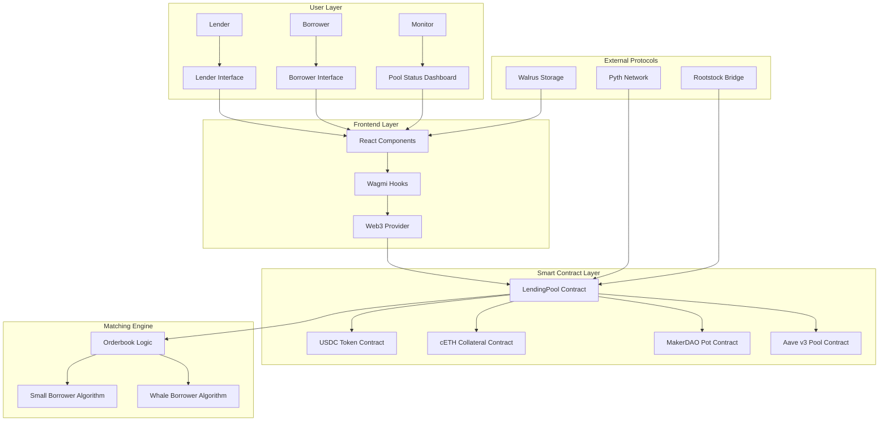

# 🏗️ Architecture Documentation

## Overview


The DeFi Lending Protocol is built with a modular architecture that separates concerns between the frontend interface, smart contract layer, and external protocol integrations. This document provides a comprehensive overview of the system architecture.

## System Architecture



## Smart Contract Architecture

### Core Contracts

#### LendingPool.sol
The main protocol contract that handles:
- Lender registration and liquidity management
- Borrower loan requests and collateral management
- Dynamic matching algorithm execution
- Interest calculation and distribution
- Cross-chain loan processing

**Key Functions:**
```solidity
function addLiquidity(uint256 amount, uint256 fixedAPY, bytes calldata metadata)
function requestLoan(uint256 amount, uint256 collateralAmount, bytes calldata loanDocument, string calldata targetChain)
function repayLoan()
function updateStableAPY() returns (uint256)
```

#### MockUSDC.sol
ERC-20 token contract for testing and development:
- Standard ERC-20 functionality
- Minting capabilities for testing
- 6 decimal precision

#### MockCETH.sol
Collateral token contract:
- ERC-20 compatible
- 18 decimal precision
- Faucet function for testing

### Integration Contracts

#### MockMakerPot.sol
Mock implementation of MakerDAO's Pot contract:
- DSR (Dai Savings Rate) functionality
- Returns 5% APY for testing
- Chi calculation for interest accrual

#### MockAaveV3Pool.sol
Mock implementation of Aave v3 Pool:
- Reserve data structure
- Supply APY calculation
- Returns 3.5% APY for testing

## Frontend Architecture

### Component Structure

```
components/
├── LenderInterface.jsx      # Lender interaction component
├── BorrowerInterface.jsx    # Borrower interaction component
├── PoolStatus.jsx          # Real-time pool statistics
├── OrderbookVisualizer.jsx # Matching algorithm visualization
└── NetworkValidator.jsx    # Network connection validation
```

### State Management

The frontend uses React hooks for state management:
- `useAccount` - Wallet connection state
- `useContractRead` - Smart contract data fetching
- `useContractWrite` - Smart contract interactions
- `useLendingDataStorage` - Walrus storage integration

### Data Flow

1. **User Interaction** → React Component
2. **State Update** → React Hook
3. **Contract Call** → Wagmi Hook
4. **Transaction** → Web3 Provider
5. **Blockchain** → Smart Contract
6. **Event** → Frontend Update

## Matching Algorithm

### Small Borrower Algorithm (< 1,000 USDC)

```javascript
function matchSmallBorrower(amount, lenders) {
  // Sort lenders by APY (ascending - lowest first)
  const sortedLenders = lenders.sort((a, b) => a.fixedAPY - b.fixedAPY);
  
  const matches = [];
  let remainingAmount = amount;
  
  for (const lender of sortedLenders) {
    if (remainingAmount <= 0) break;
    if (!lender.active || lender.availableAmount <= 0) continue;
    
    const chunkAmount = Math.min(remainingAmount, lender.availableAmount);
    
    matches.push({
      lender: lender.address,
      amount: chunkAmount,
      apy: lender.fixedAPY
    });
    
    remainingAmount -= chunkAmount;
  }
  
  return { matches, remainingAmount, fullyMatched: remainingAmount === 0 };
}
```

### Whale Borrower Algorithm (≥ 1,000 USDC)

```javascript
function matchWhaleBorrower(amount, lenders) {
  // Sort lenders by APY (descending - highest first)
  const sortedLenders = lenders.sort((a, b) => b.fixedAPY - a.fixedAPY);
  
  // Same matching logic as small borrower
  // but with highest APY priority
}
```

## Protocol Integrations

### Pyth Network Integration

**Purpose**: Real-time price feeds and APY reference rates

**Implementation**:
```solidity
interface IPythOracle {
    function getPrice(bytes32 priceId) external view returns (PythStructs.Price memory);
    function updatePriceFeeds(bytes[] calldata updateData) external payable;
}
```

### Walrus Storage Integration

**Purpose**: Decentralized storage for metadata and documents

**Implementation**:
```javascript
const storeLendingData = async (data) => {
  const response = await fetch(`${publisher}/v1/blobs?epochs=1`, {
    method: 'PUT',
    body: JSON.stringify(data),
    headers: { 'Content-Type': 'application/json' }
  });
  return response.json();
};
```

### Rootstock Bridge Integration

**Purpose**: Cross-chain Bitcoin integration

**Implementation**:
```solidity
interface IRootstockBridge {
    function lockBTC(uint256 amount) external payable;
    function unlockBTC(uint256 amount, address recipient) external;
    function convertUSDCToRBTC(uint256 usdcAmount) external returns (uint256 rbtcAmount);
}
```

## Security Architecture

### Smart Contract Security

1. **Reentrancy Protection**: Using OpenZeppelin's ReentrancyGuard
2. **Access Control**: Owner-only functions for critical operations
3. **Input Validation**: Comprehensive parameter validation
4. **Overflow Protection**: SafeMath operations
5. **Pausable**: Emergency stop functionality

### Frontend Security

1. **Input Sanitization**: All user inputs are validated
2. **Transaction Confirmation**: Users must confirm all transactions
3. **Error Handling**: Comprehensive error handling and user feedback
4. **Wallet Security**: Integration with secure wallet providers

## Performance Considerations

### Gas Optimization

- **Batch Operations**: Multiple operations in single transaction
- **Storage Optimization**: Efficient data structures
- **Function Optimization**: Minimal external calls
- **Loop Optimization**: Efficient iteration patterns

### Frontend Performance

- **Lazy Loading**: Components loaded on demand
- **Memoization**: React.memo for expensive components
- **Debouncing**: Input debouncing for real-time updates
- **Caching**: Smart contract data caching

## Scalability

### Horizontal Scaling

- **Modular Architecture**: Independent components
- **Microservices**: Separate services for different functions
- **Load Balancing**: Multiple instances for high availability

### Vertical Scaling

- **Database Optimization**: Efficient data storage
- **Caching**: Redis for frequently accessed data
- **CDN**: Content delivery network for static assets

## Monitoring and Analytics

### Smart Contract Monitoring

- **Event Logging**: Comprehensive event emission
- **Error Tracking**: Detailed error reporting
- **Performance Metrics**: Gas usage and execution time

### Frontend Monitoring

- **User Analytics**: User behavior tracking
- **Performance Metrics**: Page load times and interactions
- **Error Tracking**: Client-side error reporting

## Deployment Architecture

### Smart Contract Deployment

1. **Local Development**: Hardhat local network
2. **Testnet**: Rootstock testnet deployment
3. **Mainnet**: Rootstock mainnet deployment

### Frontend Deployment

1. **Development**: Local development server
2. **Staging**: Vercel preview deployment
3. **Production**: Vercel production deployment

## Future Enhancements

### Planned Features

1. **Multi-token Support**: Support for additional tokens
2. **Advanced Order Types**: Limit orders, stop-loss orders
3. **Liquidation Mechanisms**: Automated liquidation system
4. **Governance Token**: Protocol governance and voting

### Technical Improvements

1. **Layer 2 Integration**: Optimistic rollups for lower fees
2. **Mobile App**: Native mobile application
3. **API Development**: Public API for developers
4. **Analytics Dashboard**: Advanced analytics and reporting

---

This architecture provides a solid foundation for a scalable, secure, and efficient DeFi lending protocol that can adapt to changing market conditions and user needs.
