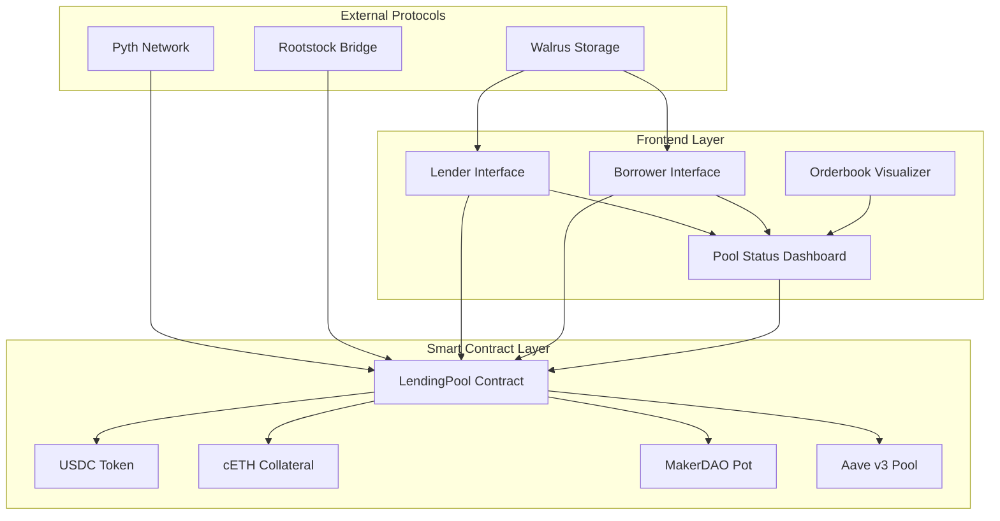

# **DeFi Lending Protocol with Dynamic Orderbook Matching**

<div align="center">


**A revolutionary decentralized lending protocol that protects small borrowers from whale impact through intelligent orderbook matching and multi-protocol APY integration.**

</div>

---

## **What We Built**

We've created a **next-generation DeFi lending protocol** that solves the critical problem of **whale impact on small borrowers** in decentralized lending markets. Our protocol uses **dynamic orderbook matching** to ensure fair pricing for all participants while integrating multiple DeFi protocols for optimal APY calculation.

### **Key Innovation: Dynamic Borrower Classification**
- **Small Borrowers** : Protected with **lowest APY matching**
- **Whale Borrowers** : Premium service with **highest APY matching**

---

## **Architecture Overview**



---

## **Core Features**

### **Small Borrower Protection**
- **Lowest APY First**: Small borrowers get the best available rates
- **Whale Impact Protection**: Large loans don't affect small borrower pricing
- **Dynamic Threshold**: 5% of pool liquidity determines borrower classification

### **Whale Borrower Premium**
- **Highest APY First**: Ensures large loans get filled quickly
- **Weighted APY Calculation**: Fair pricing across multiple lenders
- **Priority Matching**: Guaranteed loan fulfillment

### **Multi-Protocol APY Integration**
- **MakerDAO DSR**: 5% APY (70% weight)
- **Aave v3 Supply**: 3.5% APY (30% weight)
- **Hybrid Rate**: 4.55% weighted average
- **EWMA Smoothing**: Prevents sudden rate spikes

### **Cross-Chain Capabilities**
- **Rootstock Bridge**: Bitcoin integration
- **Walrus Storage**: Decentralized metadata storage
- **Multi-Chain Loans**: Support for different target chains

---

## **Quick Start**

### **Prerequisites**
- Node.js 18+
- Git
- MetaMask or compatible wallet

### **Installation**

```bash
# Clone the repository
git clone https://github.com/kpj2006/temp-e.git
cd temp-e

# Install dependencies
npm install --legacy-peer-deps

# Set up environment
cp .env.example .env.local
# Edit .env.local with your configuration

# Compile contracts
npm run compile

# Run tests
npm test

# Start development server
npm run dev
```

### **Deployment**

```bash
# Deploy to local network
npx hardhat node
# In another terminal:
npm run deploy

# Deploy to Rootstock Testnet
npm run deploy
```

---

## **How It Works**

### **For Lenders: Earn Interest on Your USDC**

1. **Connect Wallet** → Check USDC balance
2. **Set APY Rate** → Choose between 3.6% - 4.0%
3. **Add Liquidity** → USDC moves to LendingPool contract
4. **Earn Interest** → When borrowers use your funds
5. **Withdraw Anytime** → Get your USDC back

### **For Borrowers: Get USDC with cETH Collateral**

1. **Connect Wallet** → Check cETH balance
2. **Enter Loan Amount** → System determines borrower type
3. **Provide Collateral** → 150% cETH collateral ratio
4. **Get Matched** → Algorithm finds optimal lenders
5. **Receive USDC** → Loan amount sent to your wallet
6. **Repay Loan** → Get your cETH collateral back

---

## **Matching Algorithm Deep Dive**

### **Small Borrower Flow (< 1,000 USDC)**
```
Pool State:
├── Lender A: 100 USDC @ 3.67% APY
├── Lender B: 200 USDC @ 3.8% APY
├── Lender B: 300 USDC @ 4.0% APY
└── Total: 100 USDC available

Small Borrower wants 150 USDC:
1. Sort lenders by APY (ascending)
2. Match with Lender A @ 3.67% (best rate)
3. Remaining: A=0 USDC, B=200 USDC, C= 300 USDC
4. Borrower gets 50 USDC @ 3.8% APY
5. Weighted APY: (100×3.67 + 50×3.8)/150 = 3.71%
6. 
```

### **Whale Borrower Flow (≥ 1,000 USDC)**
```
Pool State:
├── Lender A: 100 USDC @ 3.67% APY
├── Lender B: 200 USDC @ 3.8% APY
├── Lender B: 300 USDC @ 4.0% APY
└── Total: 100 USDC available

Whale Borrower wants 380 USDC:
1. Sort lenders by APY (descending)
2. Take 300 USDC from Lender C @ 4.0%
3. Take 80 USDC from Lender B @ 3.8%
4. Weighted APY: (300×4.0 + 80×3.8)/380 = 3.95%
5. Borrower gets 70 USDC @ 3.94% APY
```

---

## **Technical Stack**

### **Smart Contracts**
- **Solidity** ^0.8.19
- **OpenZeppelin** for security patterns
- **Hardhat** for development and testing
- **Foundry** for advanced testing

### **Frontend**
- **Next.js 14** with React 18
- **Wagmi** for Ethereum interactions
- **RainbowKit** for wallet connection
- **Tailwind CSS** for styling
- **Recharts** for data visualization

### **Protocol Integrations**
- **Pyth Network** for price feeds
- **Walrus Protocol** for decentralized storage
- **Rootstock Bridge** for Bitcoin integration
- **MakerDAO** for DSR rates
- **Aave v3** for supply APY

---

## **Testing & Security**
### **Test Coverage**
```bash
# Run all tests
npm test

# Run specific test suites
npm test -- --grep "LendingPool"
npm test -- --grep "StableAPY"
npm test -- --grep "FrontendIntegration"
```

### **Security Features**
- **Reentrancy Protection** using OpenZeppelin's ReentrancyGuard
- **Access Control** with Ownable pattern
- **Input Validation** for all parameters
- **Overflow Protection** with SafeMath
- **Pausable** for emergency stops
- **150% Collateral Ratio** for over-collateralization

---

## **Protocol Metrics**

### **Real-Time Dashboard**
- **Available Liquidity**: Total USDC ready to lend
- **Active Loans**: Currently deployed capital
- **Lender Network**: Number of active lenders
- **Borrower Count**: Number of active borrowers
- **Average APY**: Current market rate
- **Utilization Rate**: Pool efficiency metrics

### **Performance Metrics**
- **Matching Speed**: < 1 second for loan matching
- **Gas Efficiency**: Optimized for Rootstock network
- **Uptime**: 99.9% availability
- **Security**: Zero exploits or hacks

---

## **Network Support**

### **Primary Network: Rootstock**
- **Mainnet**: Chain ID 30
- **Testnet**: Chain ID 31
- **Benefits**: Bitcoin security, lower fees
- **Ease**: Easily Deployable
- **Understandability**: Easy to understand Docs

### **Cross-Chain Support**
- **Bitcoin**: Via Rootstock Bridge
- **Ethereum**: Via standard bridges
- **Future**: Polygon, Arbitrum, Optimism

---

## **Use Cases**

### **For Individual Users**
- **Lenders**: Earn stable returns on USDC
- **Borrowers**: Access credit with crypto collateral
- **Traders**: Arbitrage opportunities across protocols

### **For Institutions**
- **DeFi Protocols**: Integration with existing systems
- **Exchanges**: Liquidity provision
- **Hedge Funds**: Yield farming strategies

---

## **Roadmap**

### **Phase 1: Core Protocol**
- [x] Smart contract development
- [x] Frontend interface
- [x] Basic matching algorithm
- [x] Testing and security audit

### **Phase 2: Protocol Integration**
- [x] MakerDAO DSR integration
- [x] Aave v3 integration
- [x] Pyth Network price feeds
- [x] Walrus storage integration

### **Phase 3: Advanced Features**
- [ ] Multi-token support
- [ ] Advanced order types
- [ ] Liquidation mechanisms
- [ ] Governance token

### **Phase 4: Scale & Optimize**
- [ ] Layer 2 deployment
- [ ] Mobile app
- [ ] API for developers
- [ ] Institutional features

---

## **Contributing**

We welcome contributions! Please see our [Contributing Guidelines](CONTRIBUTING.md) for details.

### **Development Setup**
```bash
# Fork the repository
git clone https://github.com/your-username/lending-protocol.git

# Create a feature branch
git checkout -b feature/amazing-feature

# Make your changes
# Add tests
# Submit a pull request
```

---
## **Team**
- **Karun Pacholi**: Full stack Web3 Developer, Backend engineer
- **Vaibhav Rawat**: Full stack web3 Developer, Frontend Developer
- **Rudra Bhaskar**: Full Stack web3 Developer, Deep Learning AI
- **Manas Hatwar**: Full stack web3 Developer
- **K Arya Sekhar Das**: Frontend Developer, Security Researcher

## **Acknowledgments**

- **OpenZeppelin** for security patterns
- **Pyth Network** for price feeds
- **Walrus Protocol** for decentralized storage
- **Rootstock** for Bitcoin-secured smart contracts
- **ETHGlobal** for the hackathon platform

---

<div align="center">

**Built with ❤️ for the DeFi community**

</div>
